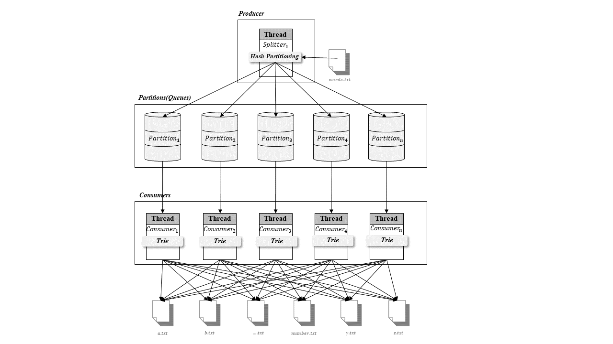

**Producer Consumer 패턴을 이용한 단어 분류 시스템 구현**

작성자: crubeido@gmail.com

# 시스템 설명
## 시스템 디자인


## **Partition**
* Producer로부터 전달받은 단어를 Consumer가 가져갈수 있도록 Queue(buffer)에 저장하는 class
* Queue가 비어있을 때 동기화 기능 제공
* 병렬 처리를 위해 N개의 파티션으로 구성될 수 있음
## **Producer**
* input 파일(words.txt)을 읽어 단어를 Partition에 전달하는 class
* 알파벳이나 숫자로 시작하지 않는 단어는 유효하지 않기 때문에 정규식으로 유효성 검사하여 제외시킴
* 동일한 단어(대소문자 구분없이)는 동일한 파티션에 포함시키기 위해 hash partitioning(Folding)을 사용
* hash partitioning을 통해 partition들의 load balancing을 가능하게함
* round robin 방식은 load balancing이 가능하지만 동일한 단어를 같은 partition으로 전달하는 것이 불가능하여 제외
* range partitioning 방식은 동일한 단어를 같은 partition으로 전달하는 것은 가능하지만 load balancing이 불가능하여 제외
## **Consumer**
* Partition으로부터 단어를 가져온뒤 저장해야하는 파일에 해당단어가 존재하는지 중복검사후 파일끝에 추가해주는 class
* 병렬 처리를 위해 하나의 Consumer는 하나의 Partition을 가지고 단어를 가져옴(Has-A 관계)
* 파일에 존재하는지 중복검사(대소문자 구분없음)를 위해 Trie자료구조 객체를 하나 가짐(Has-A 관계)
* 단어가 알파벳으로 시작하면 해당 알파벳으로 시작하는 파일에 추가(ex. 단어가 egg면 e.txt에 저장, 대소문자 구분없음)
* 단어가 숫자로 시작하면 number.txt 파일에 추가(ex. 단어가 1-point면 number.txt에 저장)
* 모든 Consumer는 단어에 따라 모든 파일(a~z.txt또는 number.txt)에 추가가 가능
* 파일락을 사용하는 경우 파일이 사용중일 때는 Partition에서 pop해온 단어를 다시 push하고 Trie에 insert한 단어를 delete함으로써 롤백시킴
## **Trie**
* 단어 중복을 검사하기 위한 자료구조 class
* KMP는 O(File.length * word.length) 시간에 검사가 가능하기 때문에 속도문제로 O(word.length) 시간에 검사 가능한 Trie 자료구조 사용
* 메모리 사용량 문제가 있으나 병렬 시스템에서는 속도가 우선순위가 높기 때문에 Trie자료구조 선택

# 성능 실험
* 파티션 수를 1개씩 늘려가며 병렬처리 성능(단어 분류에 걸리는 시간)을 측정
* **실험환경**: 프로세서(AMD FX(tm)-8300 Eight-Core Processor 3.30 GHz), 메모리(16GB)
* **일반버전**: Consumer에서 파일을 write할때 파일락없이 수행한 버전
* **파일락버전**: Consumer에서 파일을 write할때 파일락을 걸고 수행한 버전

  |파티션수|일반버전(millisec)|파일락버전(millisec)|
  | ------ |:----------------:| ------------------:|
  |       1|            127622|              167267|
  |       2|             91452|               93806|
  |       3|             65807|               81752|
  |       4|             54485|               75404|
  |       5|             50971|               77982|
  |       6|             47420|               62723|
  |       7|             47852|               74519|
  |       8|             49874|               72044|
  |       9|             50733|               64093|
  |      10|             51386|               72481|

  1. single thread로 파일을 write하는 것보다 multi threads로 파일을 write하는 것이 일반버전, 파일락버전 모두 좋은 결과를 보였음
  2. 일반버전과 파일락버전 모두 파티션수가 6개까지 처리속도가 좋아졌으나, 7개부터 처리속도가 다시 감소되는것으로 보아, 파티션 7개 시점에 producer의 fan-out에서 병목이 발생하는 것으로 추정됨(producer의 throughput 측정이 필요함)
  3. 파일락버전에서 fluctuation이 보이는 이유는 불규칙한 파일락으로 인해 비슷한 처리속도에서는 파일락이 걸린 수만큼 성능이 저하되는 일이 발생하는 것으로 추정됨(파일락이 걸린 횟수 측정이 필요함)

# 결과물 검증
**input의 단어 count에서 프로그램 수행과정에서 제외(중복, 특수문자)되는 단어 count를 빼면 최종 output의 단어 count를 구하는 것이 가능**

* input인 words.txt의 단어 count를 구하면 총 466551개
```bash
$ cat words.txt | wc -l
466551
```

* 중복 발생하는 단어 count를 구하기 위해 모두 소문자로 변경한뒤 정렬해서 중복 발생하는 단어만 출력하고 제외되는 단어 count를 구하면 총 4개
```bash
$ cat words.txt | tr '[A-Z]' '[a-z]' > lower.txt
$ cat lower.txt | sort | uniq -dc
      2 as
      2 dino
      2 the
      2 to
```

* 특수문자로 시작해서 제외되는 단어의 count를 구하기 위해 정규표현식을 사용하면 38개가 나옴
```bash
$ grep ^[^A-Za-z0-9] words.txt | wc -l
38
```

* 중복과 특수문자로 인해 제외되는 단어 count는총 42개로 input의 단어 count에서 이를 빼면 output의단어 count는**466509개**가 나와야함

* output파일들의 단어 count를 출력하고, 중복 단어와 특수문자로 시작하는 단어가 있는지 확인(466509가 출력되면 정상)
```bash
cat *.txt > all.txt
cat all.txt | wc -l
grep ^[^A-Za-z0-9] all.txt | wc -l
cat all.txt | tr '[A-Z]' '[a-z]' > lower.txt
cat lower.txt | sort | uniq -dc
```
